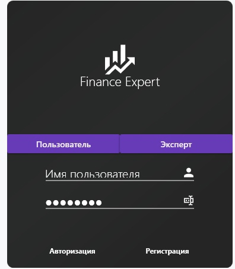
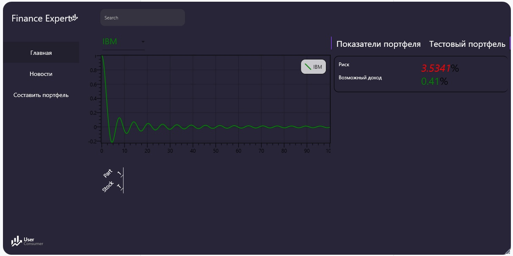

#Finance Expert
Приложение на микросервисной архитектуре для получение данных с рынка 
с помощью API Alpha Vantage 
и составления/оптимизации портфелей ценных бумаг
(ну или попытка в это).

Важно разобрать 3 модуля
- Авторизация (и отдельный сервис под это) для обычных потребителей и экспертов
- Демонстрация изменений акций на графике
- Составление и оптимизация портфеля по определенным бумагам (Портфель Марковица)
- Добавление экспертами собственных бумаг

##Авторизация

##Составление портфеля

##Визуализация портфеля
(График пока как заглушка)

